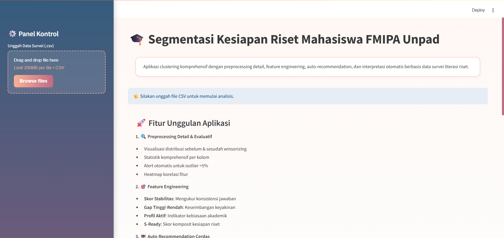
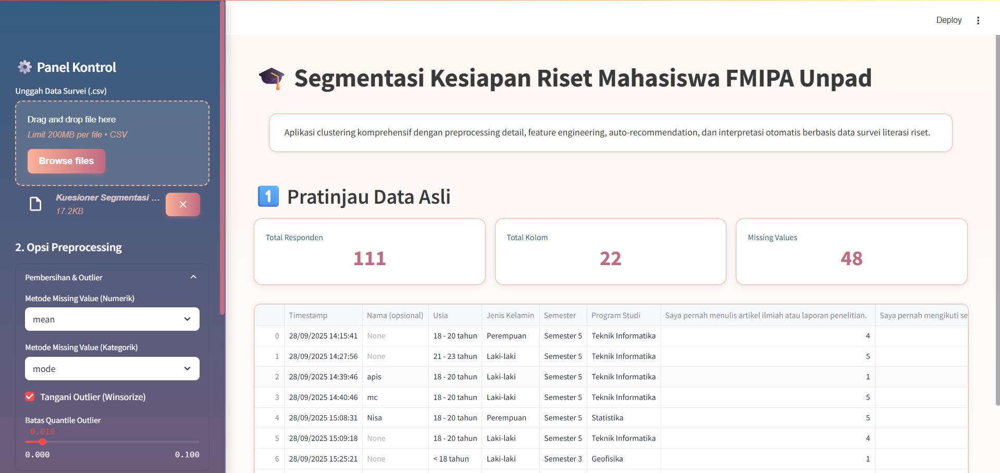
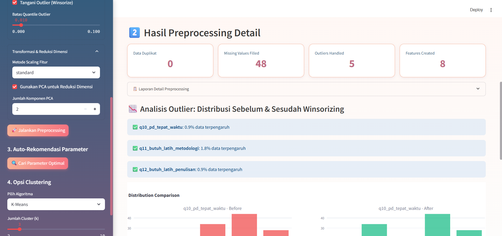
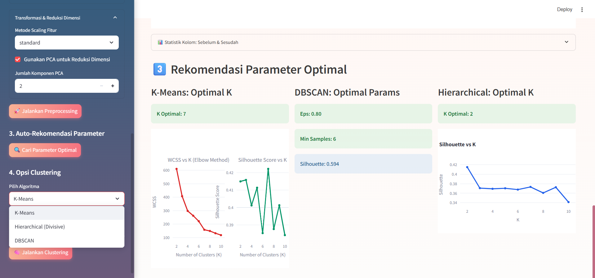
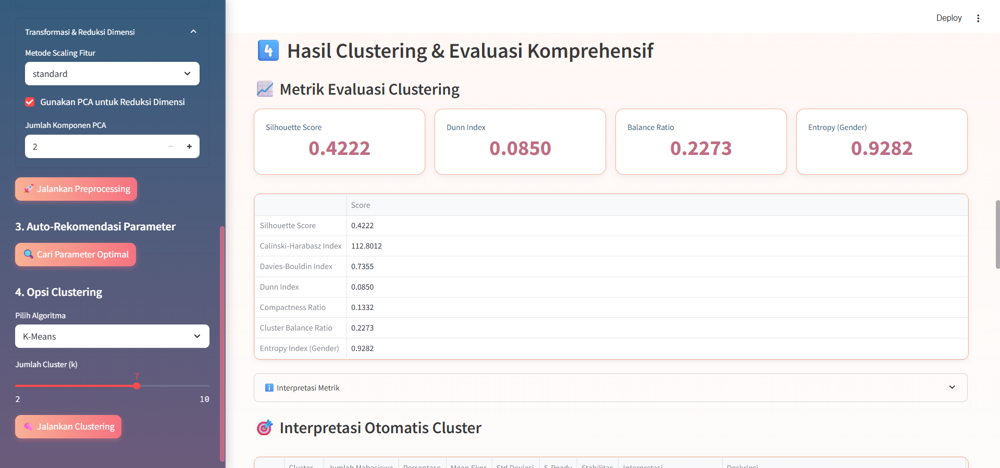

# 🎓 Segmentasi Kesiapan Riset Mahasiswa FMIPA Unpad

Aplikasi yang dikembangkan bertujuan untuk menganalisis kesiapan riset mahasiswa FMIPA Unpad menggunakan tiga metode klasterisasi yaitu K-Means, DBSCAN, dan Hierarchical Clustering.

---
## 👩‍💻 Anggota

| Adelia Felisha | Nazwa Nashatasya  | Senia Nur Hasanah | Keyna Fatima Abinalibrata |
|-------------------|-------------------|-------------------|-------------------|
| 140810230003 | 140810230019 | 140810230021 | 140810230067 |

---

## 🧭 Deskripsi Singkat

Aplikasi ini dibangun menggunakan Streamlit, sehingga dapat dijalankan secara interaktif melalui browser dan memudahkan  pihak fakultas atau program studi dalam **menganalisis kesiapan riset mahasiswa** berdasarkan hasil survei mahasiswa mengenai pengalaman, keterampilan, dan kebiasaan akademik mereka. Data dianalisis menggunakan metode klasterisasi. Hasil analisis ini diharapkan dapat :

- Mengidentifikasi kelompok mahasiswa berdasarkan pola kesiapan riset.  
- Memberikan insight dan rekomendasi akademik untuk pengembangan riset.  
- Menyediakan laporan dan visualisasi yang informatif untuk pengambilan keputusan kampus.

---

## 🚀 Fitur Utama

| Kategori | Fitur | Deskripsi |
|-----------|--------|-----------|
| 🧹 **Preprocessing** | Missing value handling, encoding, scaling, outlier winsorizing | Membersihkan dan menyiapkan data untuk clustering |
| 🧩 **Feature Engineering** | `s_ready`, `skor_stabilitas`, `gap_tinggi_rendah`, dll | Membentuk fitur turunan untuk meningkatkan interpretasi |
| 🤖 **Auto Recommendation** | K-Means (K Optimal), DBSCAN (Eps & MinPts), Hierarchical (K Optimal) | Menentukan parameter terbaik secara otomatis |
| 🧠 **Clustering Algorithms** | K-Means, Divisive Hierarchical, DBSCAN | Tiga pendekatan unsupervised yang dapat dibandingkan |
| 📈 **Evaluasi Multi-Metrik** | Silhouette, Dunn, Davies-Bouldin, Calinski-Harabasz, dll | Evaluasi kuantitatif kualitas clustering |
| 🎯 **Interpretasi Otomatis** | "Siap Riset", "Perlu Pendampingan", dll | Memberikan label makna dan rekomendasi pada tiap cluster |
| 💡 **Insight Strategis** | Analisis proporsi, keseimbangan cluster, dan rekomendasi institusional | Mendukung perencanaan strategis kampus |
| 💾 **Ekspor Data & Laporan** | CSV dan TXT | Menyimpan hasil clustering & interpretasi dalam format rapi |

---

### 🧭 Panduan Penggunaan (User Guide)

--- 

## 1️⃣ Upload Dataset

- Klik “Unggah Data Survei (.csv)” di sidebar kiri.
- Format disarankan: CSV dengan kolom berisi nilai skala Likert (1–5).

📸 **Ilustrasi:**

---
2️⃣ Pratinjau Data

Setelah upload dataset, aplikasi akan menampilkan:
- Total responden
- Total kolom
- Total missing values

Tabel pratinjau (10 baris pertama) akan muncul.

📸 **Ilustrasi:**

---

3️⃣ Opsi Preprocessing Data

Di bagian sidebar terdapat Pembersihan dan Outlier, yang terdiri dari :
- Metode Missing Value (Numerik) -> mean/median
- Metode Missing Value (Kategorik) -> mode/constant
- Tangani Outlier (Winsorize) -> Batas Quantile Outlier

Dan pada bagian sidebar terdapat Transformasi & Reduksi Dimensi, yang terdiri dari :
- Metode Scaling Fitur -> standard/minmax
- Gunaakan PCA untuk Reduksi Dimensi
- Jumlah Komponen PCA
  
Untuk melakukan Preprocessing Data, klik tombol : 🚀 Jalankan Preprocessing

Hasil yang akan muncul:

- Analisis Outlier dan Visualisasinya: Distribusi Sebelum & Sesudah Winsorizing
- Statistik Kolom Sebelum & Sesudah Preprocessing

📸 **Ilustrasi:**

---

4️⃣ Auto-Rekomendasi Parameter

Klik "🔍 Cari Parameter Optimal" maka Aplikasi akan mencari:
- K optimal (K-Means)
- Eps & MinPts (DBSCAN)
- Jumlah cluster optimal (Hierarchical)

Hasil berupa grafik Elbow, Silhouette, dan nilai parameter terbaik.

📸 **Ilustrasi:**

---

5️⃣ Jalankan Clustering

Pilih algoritma di sidebar:
- K-Means

- Hierarchical (Divisive)

- DBSCAN

Atur parameternya → (Otomatis sesuai dengan Parameter Optimal) lalu klik
"🧠 Jalankan Clustering" untuk melakukan Clustering

Hasil analisis mencakup:
- Metrik Evaluasi Clustering
- Interpretasi Otomatis Cluster
- Ringkasan Aspek per Cluster
- Visualisasi Hasil Clustering
- Insight & Rekomendasi Akademik
- Rekomendasi Strategis untuk Kampus
- Hasil Akhir : dapat mengunduh hasil clustering dalam bentuk csv atau txt

📸 **Ilustrasi:**

---

